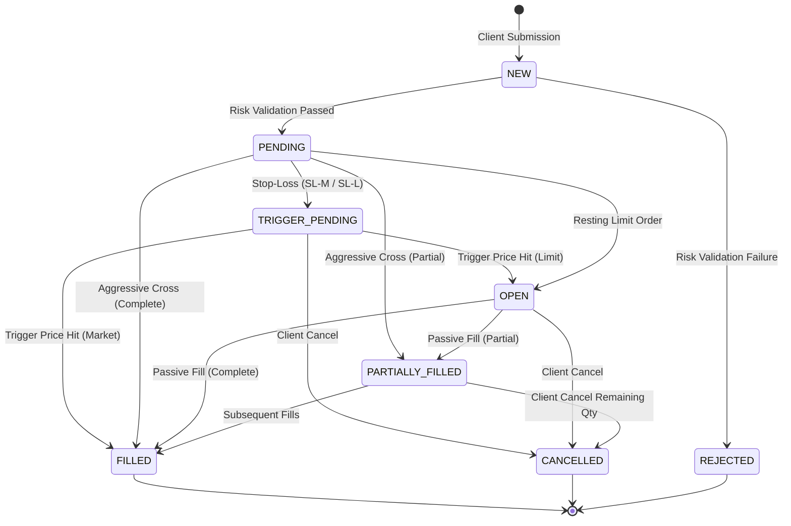

# Order Lifecycle & State Machine

## 1. State Machine Overview

An order in TradeForge traverses a deterministic set of states governed by validation, risk checks, matching, and lifecycle events:

---

## 2. Order States Definition

| State | Description | Next Allowed States |
|---|---|---|
| `NEW` | Order received via API; payload schema parsed. | `PENDING`, `REJECTED` |
| `PENDING` | Passed risk checks, en route to matching engine. | `OPEN`, `PARTIALLY_FILLED`, `FILLED`, `TRIGGER_PENDING`, `REJECTED` |
| `TRIGGER_PENDING`| Stop-Loss order awaiting price condition ($LTP \ge Trigger$ for Buy, $LTP \le Trigger$ for Sell). | `OPEN`, `FILLED`, `CANCELLED` |
| `OPEN` | Resting in the active order book awaiting contra-side liquidity. | `PARTIALLY_FILLED`, `FILLED`, `CANCELLED` |
| `PARTIALLY_FILLED`| Part of the quantity has been matched and executed; remainder rests in book. | `FILLED`, `CANCELLED` |
| `FILLED` | Terminal State: 100% of order quantity has executed. | None |
| `CANCELLED` | Terminal State: Order removed by client or expired. | None |
| `REJECTED` | Terminal State: Disallowed by pre-trade risk or invalid parameters. | None |

---

## 3. Disallowed / Invalid Transitions

The state machine strictly forbids the following invalid transitions:
* `FILLED` $\rightarrow$ `CANCELLED` (Executed trades cannot be arbitrarily retracted from the order book).
* `CANCELLED` $\rightarrow$ `OPEN` (Cancelled orders cannot be resurrected).
* `REJECTED` $\rightarrow$ `OPEN` (Rejected orders cannot enter the book).
* `FILLED` $\rightarrow$ `OPEN` (Completed orders cannot rest).

---

## 4. Audit Trail & Event Notification

Every state transition generates an immutable `OrderAuditLog` entry persisted in PostgreSQL / In-Memory Store and broadcast to the user's private WebSocket connection:

1. `ORDER_PLACED` (Status: `PENDING`)
2. `RISK_ACCEPTED` (Status: `PENDING`)
3. `ORDER_BOOKED` (Status: `OPEN`)
4. `EXECUTION_RECORDED` (Status: `PARTIALLY_FILLED` or `FILLED`)
5. `ORDER_CANCELLED` (Status: `CANCELLED`)
